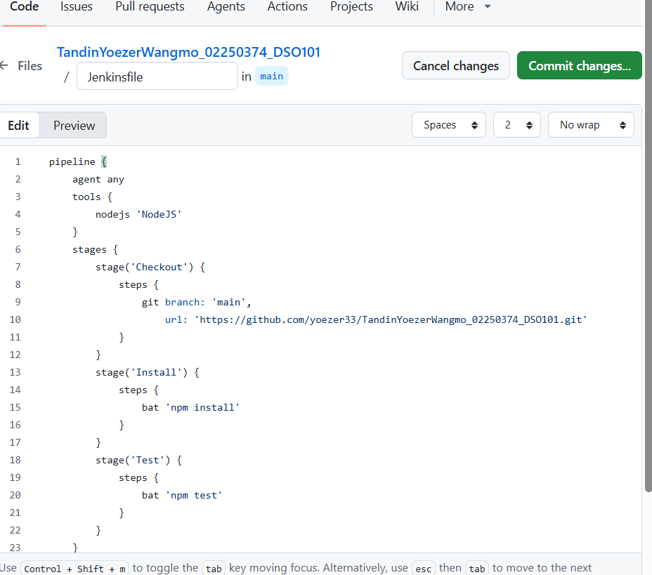

# TandinYoezerWangmo_02250374_DSO101_A1
https://github.com/yoezer33/TandinYoezerWangmo_02250374_DSO101_A1.git

# Todo App- fullstack with CI/CDpipeline
## My information
- **Name:** Tandin Yoezer Wangmo
- **Student ID:** 02250374
---
# DSO101 Assignment  - CI/CD Todo Application

**Student:** Tandin Yoezer Wangmo  
**Student ID:** 02250374  
**Module:** Continuous Integration and Continuous Deployment (DSO101)  
**Program:** Bachelor's of Engineering in Software Engineering (SWE)

---

## Table of Contents

- [Overview](#overview)
- [Project Structure](#project-structure)
- [Step 0: Web Application Setup](#step-0-web-application-setup)
- [Part A: Deploying to Docker Hub and Render](#part-a-deploying-to-docker-hub-and-render)
- [Part B: Automated Image Build and Deployment](#part-b-automated-image-build-and-deployment)
- [What I Learned](#what-i-learned)
- [Step by Step — What I Did](#step-by-step--what-i-did)
- [Challenges and How I Overcame Them](#challenges-and-how-i-overcame-them)

---

## Overview

A full-stack Todo List web application with:

- **Frontend:** UI for adding, editing, and deleting tasks
- **Backend:** CRUD REST API
- **Database:** PostgreSQL for storage and persistence

---

## Project Structure

```
/todo-app
  /frontend
    Dockerfile
    .env.production       # REACT_APP_API_URL=https://be-todo.onrender.com
  /backend
    Dockerfile
    .env.production       # DB_HOST, DB_USER, DB_PASSWORD, PORT
  render.yaml             # Blueprint for multi-service deployment
  README.md
  .gitignore
```

---

## Step 0: Web Application Setup

### Environment Variables

The application uses `.env` files for environment-specific configuration.

**Backend `.env`:**
```env
DB_HOST=your-db-host
DB_USER=your-db-user
DB_PASSWORD=your-db-password
PORT=5000
```

**Frontend `.env`:**
```env
REACT_APP_API_URL=http://localhost:5000
```

> **.env files are never committed to Git.** They are listed in `.gitignore`.

### Running Locally

```bash
# Backend
cd backend
npm install
node server.js

# Frontend
cd frontend
npm install
npm start
```

---

## Part A: Deploying to Docker Hub and Render

### 1. Build and Push Docker Images

**Backend Dockerfile:**
```dockerfile
FROM node:18-alpine
WORKDIR /app
COPY package*.json ./
RUN npm install
COPY . .
EXPOSE 5000
CMD ["node", "server.js"]
```

**Build and push backend image:**
```bash
docker build -t yoezer33/be-todo:02250374 .
docker push yoezer33/be-todo:02250374
```

**Build and push frontend image:**
```bash
docker build -t yoezer33/fe-todo:02250374 .
docker push yoezer33/fe-todo:02250374
```


### 2. Deploy on Render.com

**Backend Service:**
- Go to Render → New → Web Service
- Select **Existing image from Docker Hub**
- Image: `yoezer33/be-todo:02250374`
- Set environment variables:

| Key | Value |
|-----|-------|
| DB_HOST | your-render-db-host |
| DB_USER | your-db-user |
| DB_PASSWORD | your-db-password |
| PORT | 5000 |

**Frontend Service:**
- Same process as backend
- Image: `yoezer33/fe-todo:02250374`
- Set environment variable:

| Key | Value |
|-----|-------|
| REACT_APP_API_URL | https://be-todo.onrender.com |

**Database:**
- Use Render's managed PostgreSQL service


---

## Part B: Automated Image Build and Deployment

### render.yaml Configuration

The `render.yaml` file automates multi-service deployment. Every new Git push triggers a fresh build and deployment.

```yaml
services:
  - type: web
    name: be-todo
    env: docker
    dockerfilePath: ./backend/Dockerfile
    envVars:
      - key: DB_HOST
        value: your-render-db-host
      - key: PORT
        value: 5000

  - type: web
    name: fe-todo
    env: docker
    dockerfilePath: ./frontend/Dockerfile
    envVars:
      - key: REACT_APP_API_URL
        value: https://be-todo.onrender.com
```

### How It Works

1. Push code changes to GitHub
2. Render detects the new commit automatically
3. Render builds a new Docker image from the Dockerfile
4. Render deploys the new image — zero manual steps required


---

## What I Learned

- **Docker is not installed inside containers** — Docker CLI only exists on the host machine. Containers are isolated environments that only have what you put in them.
- **Exit codes tell you how a process ended** — Exit 0 means success, exit 1 means error, exit 127 means command not found, and exit 130 means the process was interrupted by Ctrl+C (SIGINT signal, 128+2=130).
- **The difference between running containers interactively vs detached** — `-it` gives you a shell inside the container, `-d` runs it in the background.
- **Dockerfiles are text files, not terminal commands** — You write instructions in a file and then build from it using `docker build`.
- **Environment variables keep secrets safe** — Never commit `.env` files to Git. Use `.gitignore` to exclude them.
- **`--rm` keeps things clean** — Adding `--rm` to `docker run` automatically removes the container after it stops.
- **`docker container prune` is your best friend** — It removes all stopped containers at once.
- **render.yaml automates everything** — Like docker-compose but for cloud deployment. One file to configure and deploy multiple services.
- **Every Git push triggers a new deployment on Render** — This is the core concept of CI/CD: code changes automatically build and deploy without manual steps.

---

## Step by Step — What I Did

### Step 0: Built the Todo Web Application

1. Created a full-stack todo app with frontend, backend, and database
2. Set up `.env` files for environment variables:
   - Backend: `DB_HOST`, `DB_USER`, `DB_PASSWORD`, `PORT=5000`
   - Frontend: `REACT_APP_API_URL=http://localhost:5000`
3. Added `.env` to `.gitignore` so secrets are never committed to Git
4. Tested the app locally to confirm frontend, backend, and database all worked together

### Step 1: Practiced Docker Basics

1. Pulled and ran the `centos:7` image:
   ```powershell
   docker run centos:7 echo "Hello World"
   ```
2. Ran containers interactively:
   ```powershell
   docker run -it centos:7 bash
   ```
3. Practiced different exit codes:
   ```powershell
   docker run centos:7 bash -c "exit 1"       # exit 1
   docker run centos:7 bash -c "unknowncommand" # exit 127
   ```
4. Produced exit code 130 by running `sleep 100` inside a container and pressing Ctrl+C:
   ```bash
   sleep 100   # Ctrl+C
   echo $?     # printed 130
   ```
5. Cleaned up all stopped containers:
   ```powershell
   docker container prune
   ```

### Step 2: Wrote Dockerfiles

1. Created a `myproject` folder:
   ```powershell
   mkdir myproject
   cd myproject
   ```
2. Opened Notepad and wrote the Dockerfile:
   ```powershell
   notepad Dockerfile
   ```
3. Inside Notepad, wrote:
   ```dockerfile
   FROM centos:7
   RUN echo "Hello from my custom image!"
   CMD ["echo", "Container started!"]
   ```
4. Built and ran the image:
   ```powershell
   docker build -t myimage .
   docker run --rm myimage
   ```
5. Wrote proper Dockerfiles for backend and frontend of the todo app:

   **Backend Dockerfile:**
   ```dockerfile
   FROM node:18-alpine
   WORKDIR /app
   COPY package*.json ./
   RUN npm install
   COPY . .
   EXPOSE 5000
   CMD ["node", "server.js"]
   ```

### Step 3: Pushed Images to Docker Hub (Part A)

1. Logged into Docker Hub:
   ```powershell
   docker login
   ```
2. Built and tagged the backend image with student ID:
   ```powershell
   docker build -t yoezer33/be-todo:02250374 .
   docker push yoezer33/be-todo:02250374
   ```
3. Built and tagged the frontend image:
   ```powershell
   docker build -t yoezer33/fe-todo:02250374 .
   docker push yoezer33/fe-todo:02250374
   ```
4. Verified both images appeared on Docker Hub dashboard


### Step 4: Deployed on Render.com (Part A)

1. Logged into [render.com](https://render.com)
2. Created a new **Web Service** for the backend:
   - Selected "Existing image from Docker Hub"
   - Image: `yoezer33/be-todo:02250374`
   - Added environment variables: `DB_HOST`, `DB_USER`, `DB_PASSWORD`, `PORT=5000`
3. Created a new **Web Service** for the frontend:
   - Image: `yoezer33/fe-todo:02250374`
   - Added environment variable: `REACT_APP_API_URL=https://be-todo.onrender.com`
4. Created a managed **PostgreSQL** database on Render
5. Confirmed both services were running and the app was accessible online


### Step 5: Configured Automated Deployment (Part B)

1. Created `render.yaml` in the root of the project:
   ```yaml
   services:
     - type: web
       name: be-todo
       env: docker
       dockerfilePath: ./backend/Dockerfile
       envVars:
         - key: DB_HOST
           value: your-render-db-host
         - key: PORT
           value: 5000

     - type: web
       name: fe-todo
       env: docker
       dockerfilePath: ./frontend/Dockerfile
       envVars:
         - key: REACT_APP_API_URL
           value: https://be-todo.onrender.com
   ```
2. Pushed the repository to GitHub:
   ```bash
   git add .
   git commit -m "Add render.yaml for automated deployment"
   git push origin main
   ```
3. Connected the GitHub repository to Render using the Blueprint feature
4. Verified that pushing a new commit automatically triggered a new build and deployment on Render


---

## Challenges and How I Overcame Them

### 1. Running Docker Commands Inside the Container
**Challenge:** After running `docker run -it centos:7 bash`, I tried to run `docker ps -a` inside the container shell and got `bash: docker: command not found`. I did not realize I was inside the container and not on the host machine.

**Solution:** I learned to distinguish between the two prompts:
- `PS C:\Users\wangm>` — PowerShell (host machine) — run Docker commands here
- `[root@container-id /]#` — inside the container — Docker CLI is not available here

I typed `exit` to return to PowerShell and ran Docker commands from there.

---

### 2. Understanding Docker Exit Codes
**Challenge:** I was not familiar with Docker exit codes and what they meant, particularly how to produce exit code 130.

**Solution:** I learned that exit codes follow the Unix convention of `128 + signal number`. To produce exit code 130 (SIGINT), I ran an interactive container, started `sleep 100` inside it, and pressed Ctrl+C to interrupt it:
```bash
docker run -it centos:7 bash
sleep 100   
echo $?     
```
Checking `docker ps -a` confirmed `Exited (130)` for that container.

---

### 3. Ctrl+C Causing Forceful Exit
**Challenge:** When running `docker run centos:7 sleep 30` in the foreground and pressing Ctrl+C multiple times, I got `got 3 SIGTERM/SIGINTs, forcefully exiting`. The container did not stop gracefully.

**Solution:** I learned to press Ctrl+C only once and wait for Docker to stop the container gracefully. For long-running processes, I use the `-d` (detached) flag to run containers in the background:
```powershell
docker run -d centos:7 sleep 100
```

---

### 4. Typing Dockerfile Contents Directly into PowerShell
**Challenge:** Instead of creating a Dockerfile and writing content inside it, I typed the Dockerfile instructions directly into PowerShell, which caused errors like `The 'from' keyword is not supported` and `RUN is not recognized as a cmdlet`.

**Solution:** I learned that a Dockerfile is a plain text file that must be created first using Notepad or any text editor, and Docker commands are run separately in PowerShell:
```powershell
notepad Dockerfile   # open Notepad, write Dockerfile contents, save
docker build -t myimage .   # then build from PowerShell
```

---

### 5. Accumulation of Stopped Containers
**Challenge:** After running many containers for practice, I ended up with over 22 stopped containers cluttering `docker ps -a`.

**Solution:** I used `docker container prune` to remove all stopped containers at once, and learned to use the `--rm` flag to auto-delete containers after they stop:
```powershell
docker container prune
docker run --rm centos:7 echo "Hello World"
```

## DSO101 Assignment 2 - CI/CD Pipeline with Jenkins
**Student:** Tandin Yoezer Wangmo  
**Student ID:** 02250374  
**Course:** DSO101 - Continuous Integration and Continuous Deployment  

---

## Overview
This assignment shows how  the setup of a Jenkins CI/CD pipeline to automate the build, test, and deployment of a Todo List React application developed in Assignment 1.

---

## Tools & Technologies
| Tool | Purpose |
|------|---------|
| Jenkins | CI/CD automation |
| GitHub | Source code hosting |
| Node.js 26.1.0 | JavaScript runtime |
| Jest | Unit testing framework |
| jest-junit | JUnit test reports for Jenkins |
| React | Frontend framework |
| npm | Package management |

---

## Pipeline Stages
The Jenkins pipeline have of the 3 stages:

### 1. Checkout
Pulls the latest source code from the GitHub repository:https://github.com/yoezer33/TandinYoezerWangmo_02250374_DSO101_A1
### 2. Install
Installs all required Node.js dependencies using:
```bash
npm install
```

### 3. Test
Runs unit tests using Jest with JUnit reporting:
```bash
npm test
```

---

## Pipeline Configuration

### Jenkinsfile
```groovy
pipeline {
    agent any
    tools {
        nodejs 'NodeJS'
    }
    stages {
        stage('Checkout') {
            steps {
                git branch: 'main',
                    url: 'https://github.com/yoezer33/TandinYoezerWangmo_02250374_DSO101_A1.git'
            }
        }
        stage('Install') {
            steps {
                bat 'npm install'
            }
        }
        stage('Test') {
            steps {
                bat 'npm test'
            }
        }
    }
}
```


### package.json Test Configuration
```json
"scripts": {
    "start": "react-scripts start",
    "build": "react-scripts build",
    "test": "jest --ci --reporters=default --reporters=jest-junit"
},
"devDependencies": {
    "jest": "^27.5.1",
    "jest-junit": "^17.0.0"
}
```

---

## Setup Instructions

### 1. Jenkins Setup
- Download and install Jenkins from [jenkins.io](https://jenkins.io/download)
- Run Jenkins on `localhost:8080`
- Install required plugins:
  - NodeJS Plugin
  - Pipeline
  - GitHub Integration
  - Git

### 2. Configure Node.js in Jenkins
- Go to **Manage Jenkins → Tools → NodeJS**
- Add NodeJS installation with version 26.1.0
- Name it `NodeJS`

### 3. Add GitHub Credentials
- Go to **Manage Jenkins → Credentials**
- Add **Username with Password**
- Use GitHub Personal Access Token (PAT) as password

### 4. Create Pipeline Job
- Click **New Item → Pipeline**
- Set Definition to **Pipeline script from SCM**
- Set SCM to **Git**
- Enter repository URL
- Set branch to `*/main`
- Set Script Path to `Jenkinsfile`

---

## Test Results
The pipeline runs a simple unit test using Jest:

```javascript
test('simple test', () => {
  expect(1 + 1).toBe(2);
});
```

---

## Challenges Faced

### 1. Jenkins Login Issue
- Could not sign in with the original credentials
- **Solution:** Disabled security in `config.xml` located at `C:\ProgramData\Jenkins\.jenkins\config.xml`, reset the password, then re-enabled security

### 2. Docker Container Conflict
- A previous Jenkins Docker container was conflicting with the Jenkins Windows service
- **Solution:** Stopped and removed the Jenkins Docker containers using `docker stop` and `docker rm` commands

### 3. Plugin Installation Issues
- Jenkins plugin update center was redirecting to a Chinese mirror that was inaccessible
- **Solution:** Manually downloaded `.hpi` plugin files and uploaded them via Jenkins Advanced Settings

### 4. Missing Test Script
- The `package.json` did not have a test script configured
- **Solution:** Added Jest and jest-junit as dev dependencies and configured the test script

### 5. Git Push Failures
- Large `node_modules` folder caused HTTP 408 timeout errors during push
- **Solution:** Created `.gitignore` file to exclude `node_modules` and removed it from git tracking using `git rm -r --cached node_modules`

### 6. Wrong Repository URL
- Jenkins was pulling from the wrong GitHub repository
- **Solution:** Updated both the Jenkins pipeline configuration and the Jenkinsfile to use the correct repository URL

---

## GitHub Repository
[https://github.com/yoezer33/TandinYoezerWangmo_02250374_DSO101_A1](https://github.com/yoezer33/TandinYoezerWangmo_02250374_DSO101_A1)


## Assignment 3 - CI/CD Pipeline

### Pipeline Overview
In this project, I used a CI/CD pipeline to make the process of building and deploying the application automatic. This means I don’t have to manually update or run everything each time I make changes.
Whenever I push new code to the main branch, the pipeline starts running by itself and completes a series of steps:
- Building Docker images
First, the pipeline creates Docker images for both the backend and frontend.These images are  like packaged versions of the app that include everything needed to run them properly.
- Uploading images to DockerHub
After building the images, the pipeline sends (pushes) them to DockerHub. This works like an online storage space where these app packages are saved and can be accessed anytime.
- Triggering deployment on Render.com
Finally, the pipeline sends a signal to Render.com to redeploy the application. This updates the live version of the app with the newest changes.
Because of this automation, the latest version of the project is always updated online without needing to do the steps manually. It saves time, reduces mistakes, and makes the whole process smoother.

### Tools Used
- **Docker** - used to containerize both the frontend and backend applications. This ensures that the app runs consistently across different environments.
- **GitHub Actions** - GitHub Actions is used to automate the CI/CD workflow. It handles building, testing, and deploying the application whenever changes are pushed.
- **DockerHub** - DockerHub acts as a container registry where the built Docker images are stored and managed.
- **Render.com** - Render is used to host and deploy the backend service. It automatically updates the application when triggered by the pipeline.

### Live Deployment
- **Backend:** https://be-todo-backend.onrender.com
- **Backend API test:** https://be-todo-backend.onrender.com/tasks

### GitHub Secrets Used
In this assigments, I used GitHub Secrets to safely store important information that should not be shared publicly. These secrets act like hidden keys that allow the system to work securely.

- DOCKERHUB_USERNAME
This is the username of my DockerHub account. It helps the system know which account to use when uploading Docker images.
- DOCKERHUB_TOKEN
This is a special password (access token) used instead of my real password. It allows GitHub Actions to log in to DockerHub securely and push images without exposing my actual credentials.
- RENDER_DEPLOY_HOOK_URL
This is a special link provided by Render.com. When the pipeline sends a request to this link, it tells Render to automatically redeploy the application with the latest updates.

### Challenges Faced
While setting up the CI/CD pipeline, I faced a few problems, but solving them helped me understand the process better:

- Frontend Docker build error
At first, the frontend Docker build did not work because of a permission denied error related to react-scripts. This means the system was not allowed to run that file.
- Fixing the permission issue
To solve this, I changed the file permissions using chmod, which gave the system the required access. I also directly used the correct path to react-scripts to make sure it could run properly inside the container.
- Render deployment error
Another issue happened during deployment. The pipeline tried to trigger Render, but it failed because the deploy hook URL was missing. This caused a curl error since there was no valid link to send the request to.
- Final fix for deployment
After adding the correct deploy hook URL in GitHub Secrets, the pipeline was able to successfully notify Render, and the application deployed without any issues.

### Learning Outcomes
- Using Docker to package applications
I learned how to use Docker to put my application into a “container.” Container is like a box that holds everything the app needs to run. This makes sure the app works the same way on any computer, without breaking.
- Automating tasks with GitHub Actions
I learned how to make GitHub do work automatically. For example, whenever I upload new code, GitHub Actions can build and prepare my app without me doing it manually.
- Deploying applications using Render.com
I learned how to put my application on the internet so other people can use it. Render.com helps take my app and run it online, so it becomes a real working website or API.
- Keeping important information safe with GitHub Secrets
I learned how to store sensitive information like passwords and tokens safely. Instead of writing them directly in my code (which is risky), I used GitHub Secrets to hide them, like keeping my mom's gold in a safe locker

## Screnshots
- img1 =GitHub Action greenruns
- img2 =render service live
- img3 =GitHub Secrets
- img5 =docker img
